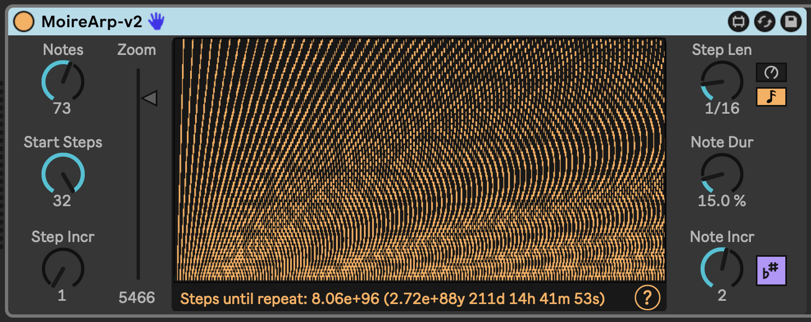

# m4l-MoireArp

An arpeggiator inspired by moiré patterns.

This creates patterns that you can discover in seas of non-repitition. The device is all about moirés, audibly and visually.

[Watch a video walkthrough and example performance](https://youtu.be/vrz0NxyW4qs) of MoireArp in action.

## Installation

[Download the .amxd file from the newest release](https://github.com/zsteinkamp/m4l-MoireArp/releases) or clone this repository, and drag the `Project/MoireArp.amxd` device into a track in Ableton Live.

## Controls

* `Notes` - Controls how many different note lanes the device emits.
* `Start Steps` - The number of steps in the base pattern.
* `Step Incr` - How many steps to add to the base pattern for each note lane.
* `Step Len` - The length of a step, in note values or milliseconds.
* `Note Dur` - How long to hold each note, in terms of percentage of time until the next note.
* `Note Incr` - For each note lane, how many semitones to increase over the previous lane.

For instance, if MoireArp is set up with `Notes` at 3, `Start Steps` at 4, `Step Incr` at 2, `Step Len` at 1/16th note, `Note Incr` at 3 and you send it a C3, it will emit C3 quarter notes (4 times 1/16th), D#3 on dotted quarters (6 times 1/16th), and F#3 on half notes (8 times 1/16th).

## Changelog

* 2024-11-25 [v1](https://github.com/zsteinkamp/m4l-MoireArp/releases/download/v1/MoireArp-v1.amxd) - Initial release.

## TODO

* ...

## Contributing

I'd love it if others extended this device. If you would like to contribute, simply fork this repo, make your changes, and open a pull request and I'll have a look.
